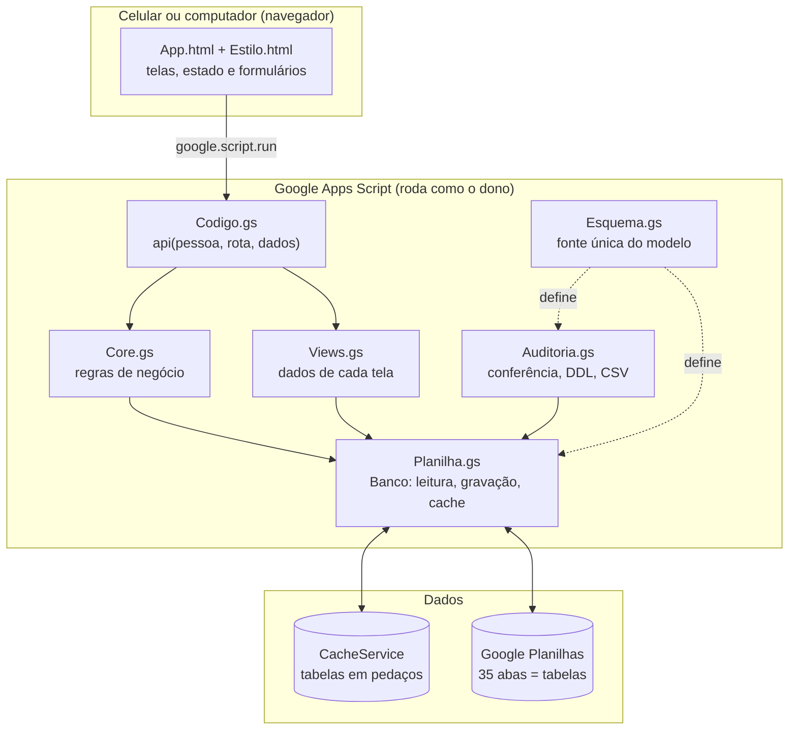
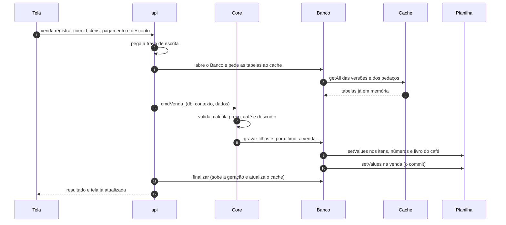
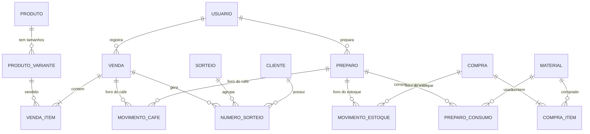

# ☕ CoffeCommit

> Uma mini operação **real** de venda de café que eu e o Digo montamos para servir de laboratório de programação e de dados.

**A ideia em uma linha:** o negócio gera dados → os dados dão forma ao sistema → o sistema me ajuda a entender o negócio.

---

## Por que este projeto existe

Eu e o Digo vendemos café em copos de 50 ml e 100 ml (normal, com canela e com leite), com a meta de operar até o Natal de 2026. A operação é pequena de propósito: dá para errar, medir e corrigir com custo baixo, e cada decisão de código que tomo esbarra num problema de verdade:

- o estoque fica dividido entre as nossas duas casas, e **cada um prepara com o que tem**;
- o café é feito em litros na cafeteira, mas **vendido em mililitros**;
- sobra café no fim do dia, e **a gente toma um pouco durante o dia**;
- preço, receita e custo **mudam com o tempo** e não podem reescrever o passado;
- as vendas alimentam um **sorteio** entre clientes, com regras próprias.

Eu faço o papel de DBA do projeto. Por isso o **modelo de dados vem antes das telas**: cada aba da planilha já é uma tabela, com nome, tipo e chave no padrão do MySQL.

### O que o sistema precisa responder

| Pergunta | Onde a resposta nasce |
|---|---|
| Quanto café pronto existe agora? | livro `movimento_cafe` |
| Quanto tem de cada material, com cada um? | livro `movimento_estoque` |
| O que foi vendido, a que preço, com que desconto? | `venda` e `venda_item` |
| Quanto custou o que foi produzido? | `preparo_consumo` (custo gravado na hora) |
| Quanto do investimento já voltou? | `compra`, `lancamento_financeiro` (payback) |
| Quando o sorteio acontece e de quem é cada número? | `sorteio`, `numero_sorteio`, `cliente` |

---

## O que o sistema faz

| Área | Resumo |
|---|---|
| **Venda** | Seis produtos, forma de pagamento, desconto manual (promoção do dia, brinde), números do sorteio e consumo próprio, tudo numa tela de poucos toques |
| **Preparo** | Registra só litros e quem preparou; os materiais podem ser completados depois, pela receita da época |
| **Compra** | Material, embalagens, valor e local, com histórico de preços (menor, maior, médio, último) e correção de compra |
| **Estoque** | Saldo por pessoa e por material, contagem ("contei o estoque"), transferência entre nós dois, ajuste e perda |
| **Fechamento do dia** | Confere se tudo o que foi preparado está explicado: vendido, perdido ou tomado |
| **Clientes e sorteio** | Cadastro mínimo, números com código, sorteios em rodadas e conferência do número sorteado |
| **Financeiro** | Aportes, reembolsos, despesas, resultado e payback por pessoa |
| **Painéis** | Sete visões por período (hoje, 7 dias, tudo), calculadas dos registros |
| **Histórico** | Tudo o que foi registrado, com "desfazer" por estorno |
| **Sistema** | Auditoria de integridade e preparo para a carga no MySQL |

---

## Princípios de projeto

São as regras que explicam a maioria das decisões abaixo.

1. **Venda e estoque nunca param.** Atualizar o código não bloqueia o app, uma tela que falhe não derruba o registro de uma venda e falta de estoque nunca trava um preparo: o sistema registra, avisa e deixa acertar depois.
2. **Nada é apagado.** Errou? Desfaz-se por *estorno*: o registro continua visível, riscado, e os livros recebem o lançamento inverso.
3. **Saldo não se digita.** Estoque e café pronto são **somas dos livros**, nunca números gravados à mão.
4. **O passado não muda.** Preço, custo, tamanho do copo e receita são *gravados no momento* do registro, e o que é cadastro mudável usa **vigência** (cria-se uma linha nova em vez de editar a antiga).
5. **Avisar, não travar.** Venda acima do café preparado, consumo acima do café pronto, estoque negativo: aceitos com aviso, e a auditoria cobra o acerto.
6. **A planilha é só o banco.** Ninguém digita nela. As abas ficam protegidas e todo registro passa pelo app.
7. **Pensar no MySQL desde o primeiro dia.** Tipos, chaves, únicos e chaves estrangeiras são declarados uma vez e geram a planilha, a auditoria e o DDL.

---

## Arquitetura

### Visão em camadas



**Uma única porta de entrada.** O navegador só chama `api(pessoa, rota, dados)`. Isso concentra autenticação, trava, cache e tratamento de erro num lugar só, e deixa o front sem nenhum conhecimento da planilha.

**Regras separadas do Google.** `Core.gs` não usa `SpreadsheetApp`: recebe um objeto `db` e um contexto (`pessoa`, `agora`) e devolve resultado. É por isso que as mesmas regras rodam num simulador local e podem, no futuro, rodar sobre o MySQL trocando apenas a camada `Banco`.

**Telas calculadas no servidor.** `Views.gs` monta o que cada tela precisa. O front só desenha e guarda estado de formulário. Cálculos delicados (café, desconto, estoque) têm uma única fonte: o servidor.

### Os módulos

| Arquivo | Responsabilidade |
|---|---|
| `Esquema.gs` | Todas as tabelas, colunas, tipos, chaves, únicos e FKs; dados iniciais; versão de instalação |
| `Core.gs` | Comandos de negócio (`cmdVenda_`, `cmdPreparo_`, `cmdCompra_`, `cmdConsumo_`, `cmdEstornar_`…) e cálculos de saldo |
| `Views.gs` | Uma função por tela, painéis por período e buscas (cliente com telefone mascarado) |
| `Planilha.gs` | Classe `Banco`: leitura em bloco, gravação, cache, instalação das abas e proteção |
| `Seguranca.gs` | Identificação da pessoa que está usando o app |
| `Auditoria.gs` | Auditoria de integridade, gerador de DDL do MySQL e exportação CSV |
| `Exemplos.gs` | Dados de exemplo gerados pelos **mesmos comandos** do app |
| `Codigo.gs` | `doGet`, `api`, menu da planilha, rotina noturna (backup e auditoria) |
| `Index/Estilo/App.html` | Front em HTML, CSS e JavaScript puros, uma página, do celular ao desktop |

### Um toque de venda, por dentro



### Gravação em duas etapas

Planilha não tem transação. Para chegar perto de uma, cada registro é gravado **de baixo para cima**: primeiro os filhos e os lançamentos nos livros, e **por último o registro principal** (venda, preparo, compra…), que funciona como o *commit*.

Se a execução cair no meio, sobra "lixo": linhas de itens ou de livro sem registro principal. Esse lixo é **inerte** (só conta no saldo o que tem origem válida) e a auditoria o aponta. Nunca fica uma venda pela metade valendo.

### Concorrência e idempotência

- Toda escrita roda dentro de `LockService`, uma de cada vez; leituras não usam trava.
- O `id` de cada registro (UUID) nasce **no aparelho**. Reenviar o mesmo toque por falha de internet devolve o resultado anterior em vez de duplicar.
- O servidor decide data, hora e **dia local** (fuso `America/Bahia`). O aparelho nunca decide em que dia uma venda caiu.

### Velocidade: cache com "geração"

Cada ida ao Google Planilhas custa de 100 a 250 ms. A primeira versão fazia **86 chamadas para registrar uma venda**. A camada `Banco` mudou isso:

| Ação | Antes | Depois |
|---|---|---|
| Abrir uma tela já vista | 12 a 32 chamadas à planilha | **0** |
| Registrar uma venda | 86 | **cerca de 5** |

Como: cada tabela é lida com **uma** chamada e guardada em memória; entre execuções ela fica no `CacheService`, em pedaços de até 30 mil caracteres; a planilha só é aberta se for preciso.

Cache errado seria perigoso num sistema de estoque, então a consistência não depende dele. Foi o que mais me preocupou nessa parte:

- cada gravação sobe a **geração** da tabela nas *Propriedades do script* (que não evaporam como o cache); entrada de cache de geração antiga é descartada;
- quem só lê nunca grava no cache sem conferir que ninguém escreveu no meio do caminho;
- se o `CacheService` falhar ou for desligado (`CACHE_DESLIGADO`), o app segue só com a planilha;
- edição manual na planilha dispara `onEdit` e limpa o cache;
- a **auditoria sempre lê a planilha**, nunca o cache.

### Identidade e acesso

Não há senha. Na primeira abertura, cada aparelho pergunta *"Quem é você?"* (eu ou o Digo) e lembra. O servidor só confere se a pessoa existe e está ativa. O web app roda "como o dono", e o **link do app funciona como a chave**: quem o tem, usa o app. A planilha em si fica só comigo (o dono), com as abas protegidas.

---

## Modelo de dados

São **33 tabelas** (mais `_esquema`, o dicionário gerado, e `_versao`), organizadas em quatro grupos:

| Grupo | Tabelas | Papel |
|---|---|---|
| **cadastro** (13) | `usuario`, `material`, `produto`, `produto_variante`, `preco_venda`, `composicao_copo`, `receita_cafe`, `fornecedor`, `forma_pagamento`, `motivo_perda`, `cliente`, `config`, `promocao` | O que muda devagar. Preço, composição, receita e configuração têm **vigência** |
| **movimento** (15) | `compra`, `compra_item`, `preparo`, `preparo_consumo`, `preparo_plano`, `venda`, `venda_item`, `consumo_proprio`, `consumo_proprio_item`, `ajuste_cafe`, `ajuste_estoque`, `lancamento_financeiro`, `numero_sorteio`, `sorteio`, `fechamento_dia` | O que acontece. **Imutável**: a única mudança permitida é `ATIVO → ESTORNADO` |
| **livro** (2) | `movimento_estoque`, `movimento_cafe` | O razão: toda entrada e saída, de onde vêm os saldos |
| **controle** (3) | `estorno`, `sequencia`, `log_sistema` | Desfazer, contadores sequenciais e erros |

### Visão simplificada



### Convenção de tipos

O **sufixo do nome** da coluna define o tipo, e o `Esquema.gs` traduz para a planilha e para o MySQL:

| Coluna | Planilha | MySQL |
|---|---|---|
| `id`, `*_id` | texto (UUID; chaves legíveis nos cadastros-base) | `CHAR(36)` |
| `*_centavos` | inteiro | `BIGINT` (dinheiro nunca é decimal em ponto flutuante) |
| `*_qtd`, `litros`, `ml_*`, `*_g` | número com 3 casas | `DECIMAL(14,3)` |
| `data_hora`, `vigente_de`, `criado_em` | texto ISO-8601 em UTC | `DATETIME(3)` |
| `dia_local` | texto `AAAA-MM-DD` (Bahia) | `DATE` |
| `status`, `tipo` | texto de lista fixa, com validação | `ENUM` |

As colunas de texto são formatadas como texto na instalação: sem isso o Planilhas transformaria o código `0453` no número 453 e as datas em objetos de data.

### Livros e saldos derivados

Nada de "estoque atual" gravado. Os saldos saem dos livros, e **só contam linhas cujo registro de origem existe e é válido**.

```
café pronto do dia = Σ movimento_cafe do dia
                   = preparado + acertos − vendido − perdido − consumido

estoque (pessoa, material) = Σ movimento_estoque
                           = compras + contagens e ajustes + transferências − perdas − consumo dos preparos
```

O dia só fecha quando o saldo do café é **zero**: tudo o que foi preparado precisa estar explicado.

### Estorno

Desfazer cria uma linha em `estorno`, muda o status do registro para `ESTORNADO` e insere **lançamentos inversos** nos livros. Não há `DELETE`. Um estorno que deixaria o estoque de alguém negativo é recusado, e registros de um dia fechado só se desfazem depois de reabrir o dia.

---

## Regras de negócio que merecem destaque

**Preparo rápido e materiais pendentes.** Registrar produção pede só litros e quem preparou: o café já entra para vender e o preparo fica com `materiais_status = PENDENTE`. O sistema *cobra* (bolinha no menu, aviso no fechamento), mas não trava. Depois, um toque lança os materiais pela **receita da época do preparo**, e só então o estoque e o custo andam.

**Receita por pessoa.** Existe a receita da casa e, opcionalmente, a de cada pessoa (eu uso filtro de pano e coloco açúcar; o Digo usa filtro de papel). Quem prepara usa a própria se tiver; senão, a da casa. O preparo guarda o que a receita mandava (`qtd_padrao`) e o que foi usado (`qtd_real`).

**Material sem controle de estoque.** A água, por exemplo, tem `controla_estoque = FALSO`: o consumo é registrado, mas ela não aparece em Estoque nem em Compra e nunca trava nada.

**Sorteio em rodadas.** Sempre existe um sorteio `ABERTO`, e cada número vendido guarda o `sorteio_id` em que nasceu. O progresso conta **números** vendidos no sorteio aberto. "Novo sorteio" encerra o atual (os números ficam guardados nele) e abre outro do zero, sem reaproveitar numeração nem códigos de 4 dígitos.

**Desconto manual.** Não é regra: eu informo o valor na hora (atalhos como "1 café grátis") e, se quiser, o motivo, uma promoção cadastrada que serve só de rótulo. `total_cafe_centavos` guarda o valor cobrado, `desconto_centavos` o abatimento e os itens guardam o preço de tabela, então nada se perde para os relatórios.

**Consumo próprio.** O café que eu e o Digo tomamos é registrado na hora, na própria Venda. Sai do café pronto, mas **não é venda**: não conta em faturamento, ticket médio nem sorteio.

**Volume servido x café.** Cada item guarda o tamanho do copo da época. Um café com leite de 50 ml leva 30 ml de café e 20 ml de leite, então o "volume servido" e o "café" são medidas diferentes. O estoque e o café pronto sempre usam o café.

---

## Do Google Planilhas ao MySQL

O MVP 1 roda inteiro no Google Planilhas de propósito: o foco é entender o negócio, não montar infraestrutura. A migração foi pensada desde o início para ser uma **carga**, não uma reescrita:

- `gerarDDL_()` produz os `CREATE TABLE` na ordem de dependência, com `UNIQUE`, `CHECK (>= 0)` para centavos e as chaves estrangeiras ao final;
- `exportarCSV_()` gera um CSV por tabela, colunas na ordem do esquema, mais o `schema.sql`;
- `ordemDeCarga_()` indica a ordem certa de carga;
- `auditar_()` confere antes da migração: chaves primárias e estrangeiras, tipos, enums, únicos, totais de venda e compra contra os itens, livros contra os registros, estornos, dias fechados e sequências.

Na versão com MySQL, o que muda é a camada `Banco` (hoje em `Planilha.gs`); `Core.gs`, `Views.gs` e o front permanecem.

---

## Estrutura do repositório

```
├── src/                     tudo o que roda no Google Apps Script
│   ├── Esquema.gs           modelo de dados (fonte única)
│   ├── Core.gs              regras de negócio
│   ├── Views.gs             dados de cada tela
│   ├── Planilha.gs          Banco: leitura, gravação, cache, instalação
│   ├── Seguranca.gs         identificação da pessoa
│   ├── Auditoria.gs         auditoria, DDL do MySQL, CSV
│   ├── Exemplos.gs          dados de exemplo
│   ├── Codigo.gs            api, doGet, menu, rotinas
│   ├── Index.html           página
│   ├── Estilo.html          visual
│   ├── App.html             telas e comportamento
│   └── appsscript.json      manifesto (fuso, permissões, web app)
├── local/                   simulação do ambiente Google, só para desenvolvimento
│   ├── planilha-local.js    imita Planilhas, Lock, Cache, Properties, Utilities, Drive
│   ├── carregar.js          carrega os .gs na mesma ordem do Apps Script
│   ├── servidor.js          servidor de desenvolvimento
│   └── teste.js             testes automáticos das regras
├── .vscode/settings.json
├── package.json
└── README.md
```

O simulador reproduz detalhes que costumam esconder bugs no Planilhas real: texto parecido com número vira número (`"0453"` → `453`) e texto parecido com data vira data quando a coluna não está formatada como texto; gravar fora da grade da aba dá erro; o `CacheService` recusa valores acima de 100 KB.

---

## Qualidade

- **510 verificações automáticas** das regras: venda, preparo, compra, estoque, fechamento, estorno, sorteio, desconto, consumo, painéis, auditoria, DDL e migração de planilhas já instaladas.
- **Painéis conferidos contra os registros:** os testes recalculam cada número de cada painel direto das linhas e comparam com a tela.
- **Teste diferencial do cache:** depois de cada uma de mais de vinte operações, todas as telas lidas com cache são comparadas com as lidas direto da planilha e precisam ser idênticas. Cache sumindo, corrompido ou falhando também não pode mudar resultado.
- **Orçamento de chamadas:** os testes falham se uma gravação passar de 8 chamadas à planilha ou se abrir uma tela já vista tocar na planilha.
- **Auditoria própria:** aponta registros inconsistentes, lixo de gravação interrompida e estoque negativo.
- O front é conferido por automação de navegador em oito tamanhos de tela (320 a 1920 px); esses scripts ainda não estão versionados aqui.

---

## Segurança e privacidade

- Dados de cliente limitados ao necessário para o sorteio: **nome, telefone e e-mail**, com `consentimento_em` registrado no cadastro.
- A tela de Venda **nunca recebe a lista de clientes**: a busca devolve no máximo 3 resultados, com telefone mascarado.
- Sem senha no app: o link é a chave, e por isso fica só entre mim e o Digo.
- A planilha é compartilhada só com o dono e as abas são protegidas contra edição manual.
- Toda gravação registra quem e quando (`criado_por`, `criado_em`), e erros vão para `log_sistema`.
- Rotina noturna: cópia da planilha no Drive (14 dias) e auditoria.

---

## Estado atual e próximos passos

**Hoje:** MVP 1 completo no Google Planilhas, testado em simulador e em navegador, e em fase de testes, por mim e pelo Digo, no Google real.

**Próximos passos**

- [ ] Carga para o MySQL e camada `Banco` sobre ele
- [ ] Fila offline no aparelho (hoje, sem internet, a ação falha com aviso e pode ser repetida sem duplicar)
- [ ] Comparar períodos de promoção (antes, durante e depois) com os dados que o desconto manual já registra
- [ ] Versionar a automação de navegador no repositório

**Limites conhecidos:** a maior parte da verificação foi feita em simulador e em navegador contra um servidor local; o Google real está sendo validado aos poucos, e o desempenho no Apps Script depende do volume e do horário. Tabelas muito grandes ocupam vários pedaços de cache e, com meses de uso, convém arquivar movimentos antigos.

---

## Glossário

| Termo | Significado |
|---|---|
| **Café pronto** | Café já preparado e ainda não vendido, perdido nem tomado, em ml |
| **Preparo** | Uma leva de café feita na cafeteira, em litros |
| **Livro** | Tabela de lançamentos (entradas e saídas) de onde saem os saldos |
| **Estorno** | Desfazer sem apagar: status `ESTORNADO` e lançamento inverso |
| **Vigência** | Intervalo em que um preço, receita ou configuração vale |
| **Commit** | A gravação do registro principal, por último, que o torna válido |
| **Geração** | Contador por tabela que invalida o cache a cada gravação |
| **Rodada** | Um sorteio: começa aberto, acumula números e é encerrado |